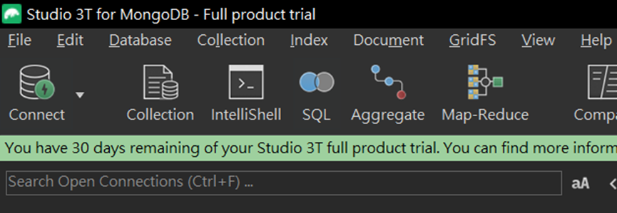

1. 打開connect

  
2. 選擇 new connection

  
3. 選擇 Manually configure my connection settings => Next

  
4. 輸入 Connection name , ex:Blog Test

  
5. 儲存

  
-- -
### 下載後可以進來確認有沒有資料
6. Connect 

  
7. Download Blog… you will see the table data.
  
